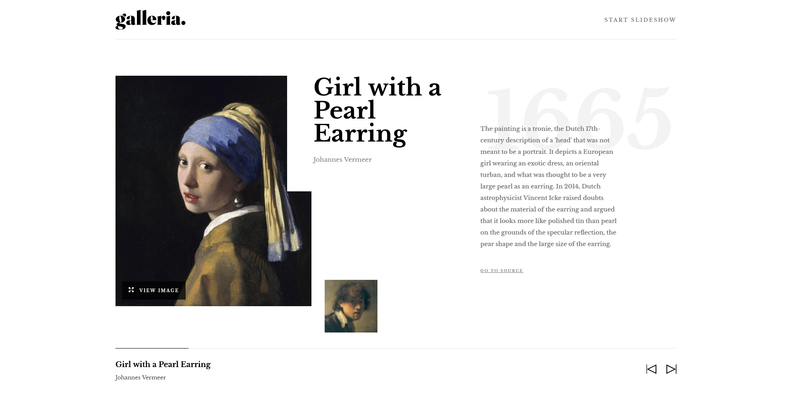

# Galleria slideshow site solution

## Overview

### The challenge

Users should be able to:

- View the optimal layout for the app depending on their device's screen size
- See hover states for all interactive elements on the page
- Navigate the slideshow and view each painting in a lightbox

### Screenshots




### Setup

To run this project locally:

```
yarn && yarn start
```

or

```
npm install && npm start
```

## My process

### Built with

- React
- React-Router-Dom
- Styled Components
- Framer-Motion
- Macy.js
- Redux Toolkit
- TypeScript
- Mobile-first workflow

### What I learned

In this project I had more practice with state management using Redux Toolkit used to control not only state of slides, but also image lightbox.
I played quite a bit with Framer-Motion to create animations, I learned how to stagger children elements, how to animate page transitions etc.
I learned one new tool I haven't used before - Macy.js - a lightweight library to create masonry grid.

If there is one code fragment I'd like to highlight, that would be slides autoplay/stop logic. Here I made use of 2 react hooks: useRef to store interval ID and preserve it before re-renders and useEffect, which if returns a function, that function will be called 1) right before next time useEffect is run 2) when component is unmounted. This was ideal use case for clearing the interval.

```js
  const id = useRef<number | undefined>()

  const clearInterval = () => window.clearInterval(id.current)

  const startInterval = useCallback(() => {
    id.current = window.setInterval(() => {
      dispatch(paginate(1))
    }, INTERVAL)
  }, [dispatch])

  useEffect(() => {
    if (isSlideshowPlaying) {
      startInterval()
    } else {
      clearInterval()
    }

    return clearInterval

  }, [currentIndex, isSlideshowPlaying, startInterval, dispatch])


  # ---------------------------- 
  
  Aleee Upgrade

  https://expressjs.com/en/starter/generator.html
  npx express-generator
  npm install
  SET DEBUG=galleria:*
  npm start

  Ver cómo poner una app React con Jade // Babel o algo así
  
```